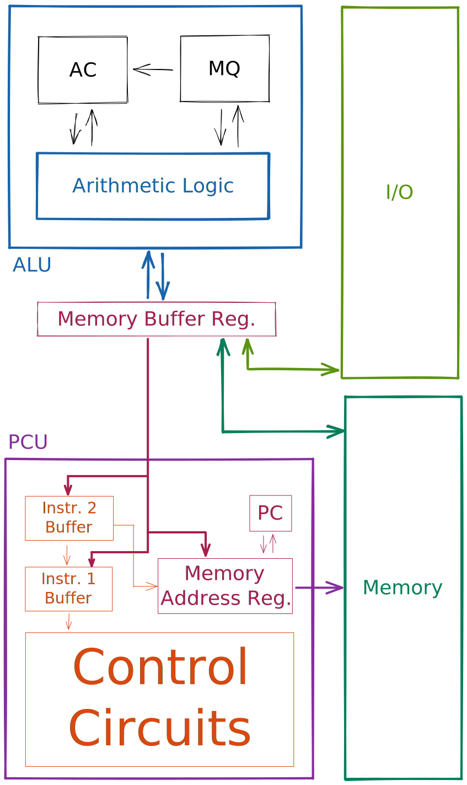

1. [x] [1951 IAS Machine Architecture](https://drive.google.com/file/d/1fwoa\_kESFA75jYDheYJAeZlso1BqrGC6/view)
    1. [x] [Word]()
    2. [x] [CPU]()
    3. [x] [Instructions]()
    4. [x] [Program]()
2. [x] [MIPS pt.1](https://drive.google.com/file/d/1gXNULU9V-o77Zd-rGHQwvdszKDAbdHT7/view)
    1. [x] [RISC vs CISC]()
    2. [x] [Numerical Systems & Standards]()
    3. [ ] [Microprocessor without Interlocked Pipelined Stages]
    4. [ ] [Instructions]()
    5. [x] [R-type Instructions]() _(register)_
    6. [x] [I-type Instructions]() _(immediate)_
    7. [x] [J-type Instructions]() _(jump)_
3. [ ] [MIPS pt.2](https://drive.google.com/file/d/1xzV-vqypdIcDoRf6Yy7QQQ2bDI03AsRi/view)
    1. [ ] [Memory Organization]()
    2. [ ] [ISA]()
    3. [ ] [Registers]() _( + 7.25)_
    4. [ ] [FR-type Instructions]()
    5. [ ] [FI-type Instructions]()
    6. [ ] [Data Types]()
    7. [ ] [Ex 1]() _(s. 10)_
    8. [ ] [Ex 2]() _(s. 11)_
    9. [ ] [Ex 3]() _(s. 17)_
4. [ ] [MIPS pt.3](https://drive.google.com/file/d/1zPNd-j8MB2BGvIXOkZ3wqt7rc55TOhJL/view)
    1. [ ] [if else]()
    2. [ ] [do while]()
    3. [ ] [while]()
    4. [ ] [for]()
    5. [ ] [switch]()
    6. [ ] [Linker & globl]()
    7. [ ] [Pseudo-Instructions]()
    8. [ ] [Ex 1]() _(s. 34)_
    9. [ ] [Ex 2]() _(s. 35)_
5. [ ] [Vectors & Matrices](https://drive.google.com/file/d/15Nt6-bs3Vsw\_N2tyTs5JuLPEFW_-iiCL/view)
    1. [ ] [Vectors]()
    2. [ ] [ASCII]()
    3. [ ] [Endianess]()
    4. [ ] [3D Matrices]()
    5. [ ] [Ex 1]() _(s. 10)_
6. [ ] [Syscalls & Procedures](https://drive.google.com/file/d/1huzOF0cJQH-wdABF-9eoQuNAYMK458LW/view)
    1. [ ] [Diagonal Sum]()
    2. [ ] [Syscalls Codes]()
    3. [ ] [Hello World]()
    4. [ ] [jal & jr]()
7. [ ] [Functions & Activation Records](https://drive.google.com/file/d/1hv1b9m6XY-kiizGSCo9gJNuHowSvzAJ2/view)
    1. [ ] [lui & ori]()
    2. [ ] [$sp]()
    3. [ ] [Ex 1]() _(s. 1)_
    4. [ ] [Ex 2]() _(s. 22)_
8. [ ] [Recursion](https://drive.google.com/file/d/1lMYGhEwdZYCAzBHU42qv\_JnXspFkU5ez/view)
    1. [ ] [factorial]()
9. [ ] [Recursion](https://drive.google.com/file/d/1qoy0XIhP64NhaCFfKU4N-XChhOTJGQcV/view)
    1. [ ] [Ex 1]() _(s. 1)_
    2. [ ] [Ex 2]() _(s. 6)_
    3. [ ] [Ex 3]() _(s. 16)_
    4. [ ] [Ex 4]() _(s. 17)_
    5. [ ] [Ex 5]() _(s. 30)_
    6. [ ] [Ex 6]() _(s. 34)_
10. [ ] [Exercises on Assembly](https://drive.google.com/file/d/1t\_DDjDgztz62KorWbXyNq1XjTG-5oqYO/view)
    1. [ ] [Ex 1]() _(s. 10)_
    2. [ ] [Ex 2]() _(s. 11)_
    3. [ ] [Ex 3]() _(s. 12)_
11. [ ] [Single Clock Cycle Architecture](https://drive.google.com/file/d/1v9vOsCyBIfoHtCxLqRW\_W-HwVDz3G1Sv/view)
    1. [ ] [Instruction Detail]()
    2. [ ] [ALU OP Codes]()
    3. [ ] [ALU Control]()
    4. [ ] [Control Signals]() _(s. 28)_
    5. [ ] [Execution Time]()
    6. [ ] [Ex 1]() _(s. 31)_
12. [ ] [New Instructions](https://drive.google.com/file/d/1wCJAPM3tON3mOJGNyEq4eRgVku-ZtwP\_/view)
    1. [ ] [lw, sw, beq, add, j, jal]()
    2. [ ] [Add New Instr.]()
    3. [ ] [Ex 1]() _(s. 27)_
13. [ ] [Malfunctions](https://drive.google.com/file/d/1zJsLx3XnT-l6ssFlrB0UzIsCNz1wfi33/view)
    1. [ ] [Malfunctions]()
    2. [ ] [Ex 1]() _(s. 11)_
14. [ ] [Exercises on Architecture]()
15. [ ] [Pipeline]()
    1. [ ] [Hazard]()
    2. [ ] [Forwarding]()
    3. [ ] [Bubble]()
    4. [ ] [Ex 1]() _(s. 21)_
16. [ ] [Pipeline & Hazard]()
17. [ ] [Pipeline & Hazard]()
18. [ ] [Exercises on Pipeline]()
19. [ ] [Pipeline & Hazard]()
20. [ ] [Exercises on Exam]()
21. [ ] [Cache](https://drive.google.com/file/d/13\_z3H6EqCx1dK84NkEVajC\_9NVXKg1Rf/view)
    1. [ ] [Memory Access]()
    2. [ ] [Direct Mapping]()
    3. [ ] [Cache Size]()
22. [ ] [Multi-Level Cache](https://drive.google.com/file/d/17E5Yzo6kRN9ujz\_nizlzxlOLH6ZZAjnl/view)
    1. [ ] [Set-Associative Mapping]() 
    2. [ ] [Replacement Policy]() 
    3. [ ] [Writing Policy]() 

# Computer Architecture

## 1. 1951 IAS Machine Architecture

The IAS Machine had a **1000 word** memory, with a **40b word** _(40000b = 5000B ~ 5kB)_

### 1. Word

Words are **CA2** integers 
| 0 | 000000000000000000000000000000000000000 |
|--|--|
|$\pm 2^{39} \cdot bit$ | $value$ | 

Instruction words contain two instructions
| 00000000 | 000000000000 | 00000000 | 000000000000 |
|:--:|:--:|:--:|:--:|
| $0..7$ | $8..19$ | $20..27$ | $28..39$ |
| **opcode** | _address_ | **opcode** | _address_ |

### 2. CPU



| | Name | Description |
|:--|:--|:--|
| **MBR** | Memory Buffer Register | receives & sends data to memory and I/O |
| **MAR** | Memory Address Register | current memory address |
| **PC** | Program Counter | address of the instruction to execute | 
| **IR** | Instruction Register | contains instruction to execute | 
| **IBR** | Instruction Buffer Register | contains the second instruction | 
| **AC** | Accumulator | for partial calculation results | 
| **MQ** | Multiplier Quotient | for partial calculation results | 

### 3. Instructions

This isn't the full _ISA_ of the **IAS Machine**, check it out [here](https://www.ecs.csun.edu/~cputnam/Comp546/Stallings/tables/T02-Vertical.pdf).

#### Transfer Instructions

| | Description |
|:--|:--|
| **LOAD** | **AC** $\leftarrow$ **AC** `operation` _**Memory**[Address]_  |
| **LOAD** | **AC** $\leftarrow$ `operation` _**Memory**[Address]_  |
| **LDMQ** | **MQ** $\leftarrow$ _**Memory**[Address]_ |
| **ST** | _**Memory**[Address]_ $\leftarrow$ **AC** |
| **AMODL** | _**Memory**[Address][0..11]_ $\leftarrow$ **AC[0..11]** _(low)_ |
| **AMODH** | _**Memory**[Address][20..31]_ $\leftarrow$ **AC[0..11]** _(high)_ |


#### Jumps 

Like in modern assembly, jumps can be **unconditional**, **conditional**; for the *IAS machine* you had to specify either a **low** or **high** address.

| | Description |
|:--|:--|
| **UBL** | **PC** $\leftarrow$ _[Address]_ |
| **UBH** | **PC** $\leftarrow$ _[Address]_ + 1 |
| **CBL** | if **AC** $\ge$ 0 { **PC** $\leftarrow$ _[Address]_ } |
| **CBH** | if **AC** $\ge$ 0 { **PC** $\leftarrow$ _[Address]_ + 1 } |


#### Operations

| | Description |
|:--|:--|
| **MUL** | **AC**, **MQ** $\leftarrow$ **AC** $\cdot$ _**Memory**[Address]_ |
| **DIV** | **AC** $\leftarrow$ **AC** / _**Memory**[Address]_
| **DIV** | **MQ** $\leftarrow$ **AC** % _**Memory**[Address]_|
| **LSHIFT** | **AC**, **MQ** $\leftarrow$ **AC**, **MQ** << ***X*** |
| **RSHIFT** | **AC**, **MQ** $\leftarrow$ **AC**, **MQ** >> ***X*** |
| **MOVE** | **AC** $\leftarrow$ **AC** `operation` **MQ** |
| **IO** | Transfer from and to I/O devices |

### 4. Example Program

```assembly
LOAD 101
ADD 102
ST 103
```

#### How does it work?

1. **Fetch**
    - MAR $\leftarrow$ PC 
    - IR, IBR $\leftarrow$ MBR $\leftarrow$ Memory[MAR]
2. **Decode**
    - MAR $\leftarrow$ IR[8..19] ; _address_
    - CU $\leftarrow$ IR[0..8] ; _opcode_
3. **Exec**
    - AC $\leftarrow$ MBR $\leftarrow$ Memory[101]
4. **Decode**
    - MAR $\leftarrow$ IBR[8..19] ; _address_
    - CU $\leftarrow$ IBR[0..8] ; _opcode_
5. **Exec**
    - AC $\leftarrow$ AC + MBR $\leftarrow$ Memory[102]
6. **PC**
    - PC $\leftarrow$ PC + 1
7. **Fetch**
    - MAR $\leftarrow$ PC 
    - IR, IBR $\leftarrow$ MBR $\leftarrow$ Memory[MAR]
8. **Decode**
    - MAR $\leftarrow$ IR[8..19] ; _address_
    - CU $\leftarrow$ IR[0..8] ; _opcode_
9. **Exec**
    - Memory[103] $\leftarrow$ MBR $\leftarrow$ AC


## MIPS pt.1

### 1. Numerical Systems & Standards

I don't care enough to study this part for the umpteenth time


### 2. RISC vs CISC

**Reduced Instruction Set Computer** vs **Complex Instruction Set Computer**

| RISC | CISC |
|:--|:--|
| **fixed size** instructions | **variable size** instructions _(requires decode before fetch)_ |
| **fixed format** | **variable format**  _(complex decode)_ |
| operations **only with registers** | **in-memory operands** |
| **many registers** | **few of registers** |
| **single access** to memory | **multiple accesses** to memory  | 
| **fixed** instruction **duration** | **variable** instruction **duration** |
| simple **conflicts** | complex **conflicts** |
| faster **pipeline** | complex **pipeline** |

### 3. Registers
### 4. Instructions

### 5. R-type Instructions

Arithmetic Instruction Format _(type to a register)_

```assembly
add $t0, $s1, $s2
```

- **opcode** add, code _000000_
- $t0 in **rd**, reg. number _01000_
- $s1 in **rs**, reg. number _10001_
- $s2 in **rt**, reg. number _10010_
- **funct** add, code *100000*

| 000000 | 10001 | 10010 | 01000 | 00000 | 100000 |
|:--:|:--:|:--:|:--:|:--:|:--:|
| $0..5$ | $6..10$ | $11..15$ | $16..20$ | $21..25$ | $26..31$ |
| 6b | 5b | 5b | 5b | 5b | 6b |
| **op** | **rs** | **rt** | **rd** | **shamt** | **funct** |
| opcode | first <br/> register <br/> source | second <br/> register <br/> source | register <br/> destination <br/> operand | shift <br/> amount | function <br/> code | 


### 6. I-type Instructions

Data Transfer Format _(conditional jumps)_

```assembly
addi $t2, $s2, 4 
```

- **opcode** addi, code _001000_
- $t2 in **rt**, reg. number _01010_
- $s2 in **rs**, reg. number _10010_

| 001000 | 10010 | 01010 | 0000000000000100 |
|:--:|:--:|:--:|:--:|
| $0..5$ | $6..10$ | $11..15$ | $16..31$ |
| 6b | 5b | 5b | 16b |
| **op** | **rs** | **rt** | **constant** |
| opcode | first <br/> register | target <br/> register | constant value or <br/> address | 

### 7. J-type Instructions

Unconditional Jumps

```assembly
j label
``` 
- PC $\leftarrow$ label $\cdot$ 4

| 001000 | 10010010100000000000000100 |
|:--:|:--|
| $0..5$ | $6..31$ |
| 6b | 26b |
| **op** | **address** |

## 3. MIPS pt.2
### 1. Memory Organization
### 2. ISA
### 3. Registers
### 4. FR-type Instructions
### 5. FI-type Instructions
### 6. Data Types

## 21. Cache

### 1. Memory Access

### 2. Direct Mapping

### 3. Cache Size

## 22. Cache

### 1. Set-Associative Mapping

### 2. Replacement Policy

### 3. Writing Policy
