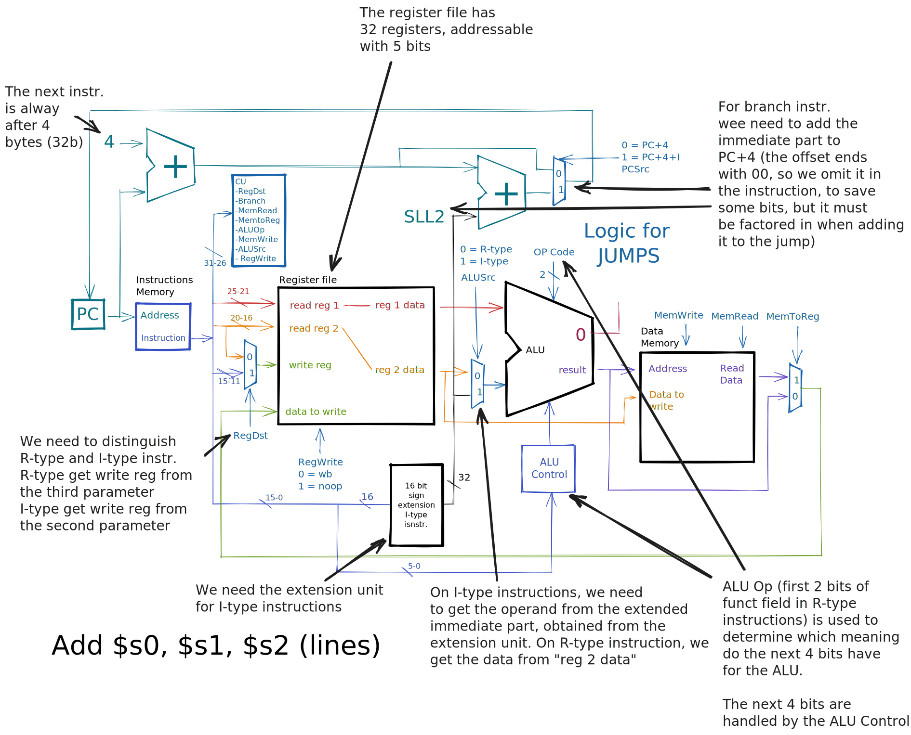
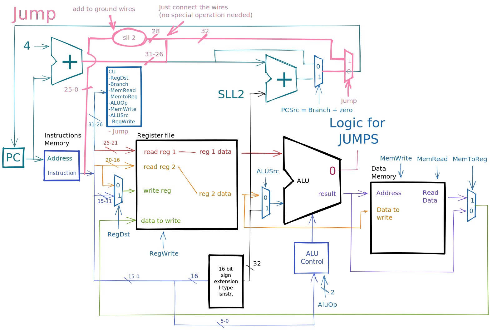
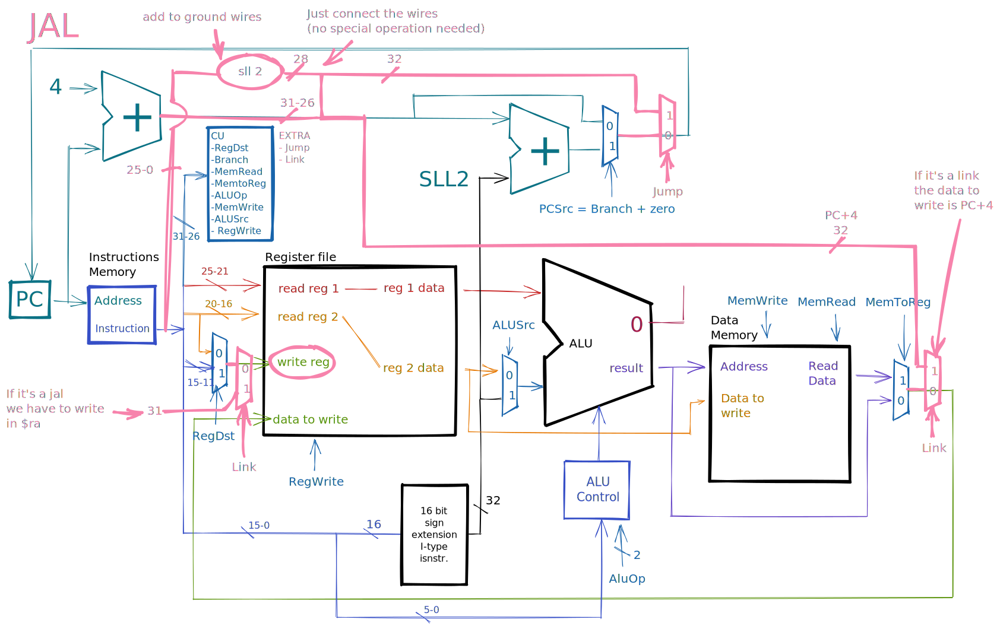
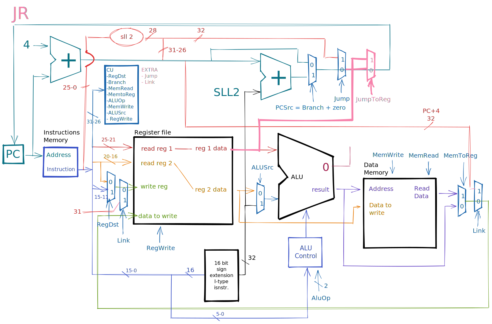
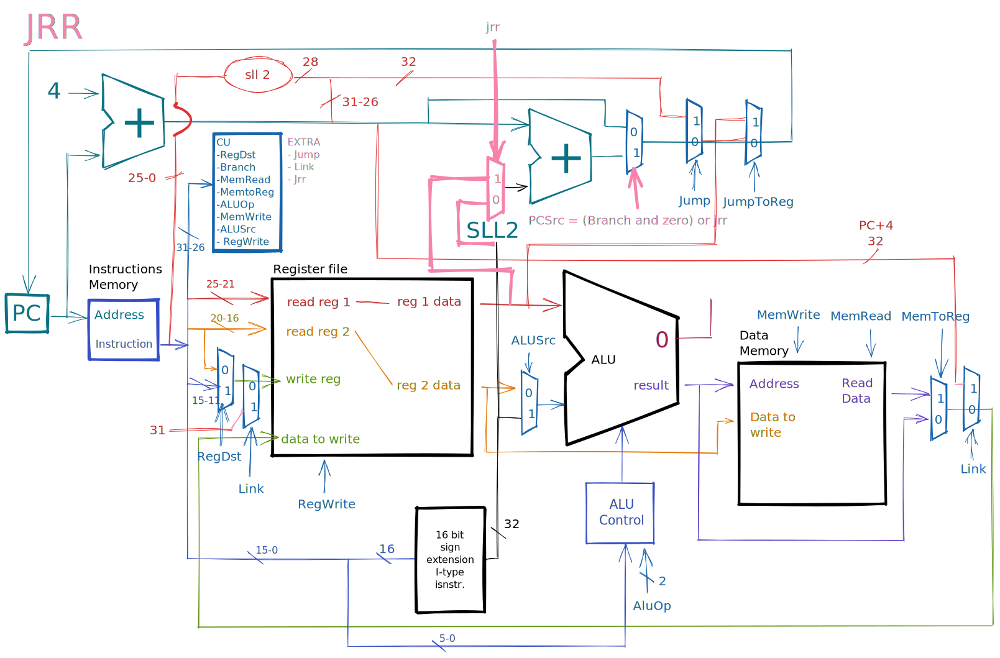

# Single Clock Cycle Architecture

## ALU Control

[R-type](./mips.md#r-type-instructions) instructions have 6 bits in the `funct` field to control the ALU. The first two bits are the `ALUOp` to indicate 1 of 3 selection codes. Based on the selection code, the next 4 bits could have a different meaning.

| opcode | ALUOp | funct field | operation | ALUControl |
|--|--|--|--|--|
| lw / sw | 00 | don't care   always a sum | sum | 0010 |
| beq | 01 | don't care   always a subtraction | sub | 0110 |
| R-type | 10 | 10_0000 | ALUControl decides   based on last 4 bits | 0010 |

Based on the instruction type, we have different behaviours for the funct field and the ALUControl.

| # | func | function |
|--|--|--|
| 0 | 0000 | AND |
| 1 | 0001 | OR |
| 2 | 0010 | add |
| 6 | 0110 | subtract |
| 7 | 0111 | slt |
| 12 | 1100 | NOR |

## Control Unit Signals

| signal | on false | on true |
|--|--|--| 
| RegDst | write register number comes from rt | write register number comes from rd |
| RegWrite | | the data is written in in the write register |
| ALUSrc | data comes from register 2 | data comes from sign extender (immediate part) |
| PCSrc | next instruction is PC + 4 | next instruction is PC + 4 + immediate |
| MemRead | | read from memory and put in read data value at address | 
| MemWrite | | data at address calculated from ALU, is overwritten by data in register 2 |
| MemToReg | data to write in register file comes from ALU | data to write in register file comes from memory |

### Exercise

> Based on the following instructions, write the truth table for the Control Unit, having as input 6 bits _(opcode)_ and as output 9 bits _(control signals)_

| op | opcode | RegDst | ALUSrc | MemtoReg | RegWrite | MemRead | MemWrite | Branch | ALUOp |
|--|--|--|--|--|--|--|--|--|--|
| R | 000000 | 1 | 0 | 0 | 1 | X | 0 | 0 | 10 |
| lw | 100011 | 0 | 1 | 1 | 1 | 1 | 0 | 0 | 00 |
| sw | 101011 | 0 | 1 | 0 | 0 | X | 1 | 0 | 00 |
| beq | 000100 | 0 | 0 | X | 0 | X | 0 | 1 | 01 |

Note: the exercise is correct, but there are some places in which we can use don't cares instead of actual values. From here, we can create a **PLA** with the necessary functions.

## Adding New Instructions

### `j`

Let's try to add a `j` _(jump)_ instruction to the current [archtecture](#single-clock-cycle-architecture).

We must define:
- it's **encoding**
- it's **behaviour**
- the **functional units** we need 
- the **flux of information**
- necessary **control signals**
- **execution time** _(and wether it impacts the total time)_

| opcode | immediate value | 
|:--:|:--:|
| 000010 | 11011101001001001001100111 |
| \\(31-26\\) | \\(25-0\\) |

The immediate value is the **absolute address** to which we have to jump to _(divided by 4)_. To get the full address we have to expand the **immediate value**: 

| PC + 4 first 4 bits | immediate value | multiplication by 4 |
|:--:|:--:|:--:|
| 0110 | 11011101001001001001100111 | 00 |

We have to shift the **immediate value** by 2, because the instructions are 4 bytes long, so we have to multiply by 4 the absolute address. Then, we get the missing 4 bits from PC + 4, so we stay within the same 256Mb block _(the first 4 bits identify the block, so the size of the block is \\(2^{28} bit = 2^8 bit * 2^{20} \approx 2^8 * 10^6 \approx 256 Mb \\))_. 

\\(PC \leftarrow (PC + 4)[31..28] \\ or \\ (instruction[25..0] << 2)\\)

We also need a `jump` control signal, to determine wether we are jumping or not, and we have to make sure that we don't write any registers or memory. In pink, the implementation of the `j` instruction.

### `jal`

The `jal` _(jump and link)_ instruction is a [J-type](./mips.md#j-type-instructions) that does the same thing as `j`, with the difference that it saves in `$ra` _(register number [31](./mips.md#registers))_ the current value of the PC + 4.

\\( $ra \leftarrow PC + 4 \\)

### `jr`

It's an [I-type](./mips.md#i-type-instructions) instruction, we just have to link whatever value we read from `rs` and move it into `PC`.

### `addi`

Not all instructions require modifications to the circuitery, like `addi`.

### Exercise 

> Add to the CPU the [R-type](./mips.md#r-type-instructions) instruction `jrr rs` _(jump relative to register)_ , which jumps to the address _(relative to the PC)_ contained in `rs`. \\(PC \leftarrow PC + 4 + reg[rs]\\)

#### Control Signals

| op | Jrr | Jump | RegDst | ALUSrc | MemtoReg | RegWrite | MemRead | MemWrite | Branch | ALUOp | 
|--|--|--|--|--|--|--|--|--|--|--|
| jrr | 1 | 0 | X | X | X | 0 | X | 0 | X | XX | 

> TODO: execution time and clock
