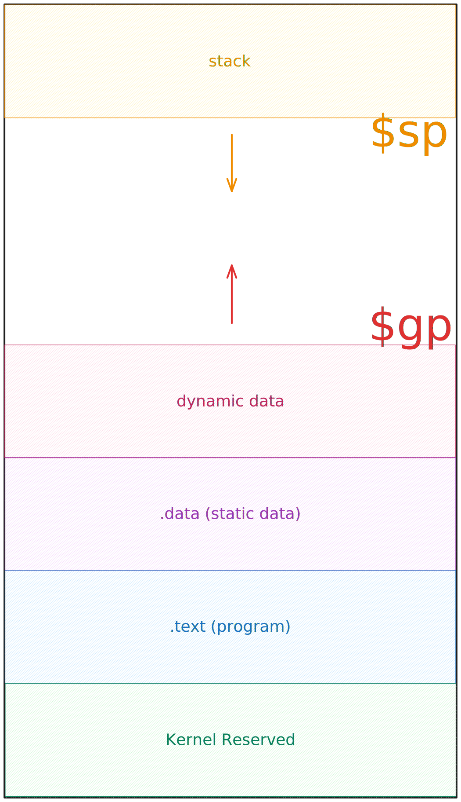

# Assembly

[wiki](https://en.wikibooks.org/wiki/MIPS_Assembly)

## Compilation 

> TODO: fill this section with instructions on how to compile assembly code

- .s -> .o
- .o -> .exe linking

- windows
- linux

## Memory Layout of a Program

<div style="max-width: 400px">

 

</div>


## Directives 

### .globl

The `.globl` directive is useful when working with multiple files, and we need parts of code to reference labels in other files. If you don't use `.globl`, during the **linking** process, it can't find the label and gives an error. 

We could have a `main.asm` file like this:

```armasm
.globl main
.data
.text
    main: 
        li $a0, 5
        jal fibonacci
        ...
```

And a second file `math.asm` with the fibonacci function:

```armasm
.globl fibonacci
.data
.text
    fibonacci:
       mv $t0, $a0 
       ...
```

### .ent

There is a `.ent` directive too, which is a **debugger pseudo operation** that marks the entry of `main`.

```armasm
.globl main
.ent main
.text
    main:
        ...
```


## Pseudo-Instructions


Many instructions provided by MIPS, like `move`, `lw` etc... are decomposed into multiple instructions when the code is assembled; [for more details](https://en.wikibooks.org/wiki/MIPS_Assembly/Pseudoinstructions). For example:

### lw

`lw $s0, value` is mapped to:

```armasm
lui $1, 0x00001001
lw $16, 0x00000000($1)
```

In the second case, `0x10010000` is the address of `value`, to get this address, we need to `lui 0x00001001` _(load upper immediate, loads the immediate value in the upper 16bits of the `$1` register, which is the `$at` register)_. Then we can load into `$16`, which is the `$s0` register, whatever value is at the address `0 + $at` _(`0x00000000($1)`)_

### move

`move $t0, $s0` is mapped to `addu $8, $0, $16`, where `addu` is the _"add unsigned"_ operation, and `$8` is `$t0`, `$0` is the `$zero` constant register and `$16` the `$s0` register.

### beq

`ble $s1, $t0, label` is mapped to:

```armasm
slt $1, $8, $17
beq $1, $0, 0x00000001
```

Now, `slt` _(set less than)_ sets the value in `rs` to **1** if `rt` is less than `rd` [_(if you don't know what rs, rt and rd are, check R-Type Instructions)_](./mips.md#r-type-instructions)

## Absolute Jump

MIPS instructions have a fixed 32 bit size... what happens when you need to **jump** to an address which is a **32 bit constant**? Neither [I-type](./mips.md#i-type-instructions) or [J-type](./mips.md#j-type-instructions) support 32 bit constants. We need to use `lui` and `ori`.

Let's suppose we have to jump at the address `0000_0000_1111_1111_0000_1001_0000_0000`, which corresponds to `0x00ff0900`.

```armasm
lui $t0, 0x000000ff
ori $t0, 0x00000900
jr $t0
```

What `lui` does is moving the lower 16 bits `0x00ff` into the upper part of register `$t0`, that way we have `0x00ff0000` in `$t0`. Now, we use `ori` _(which does a **bitwise or**, basically compares with an or for each bit in `$t0` with the value `0x00000900` for the lower half of the byte)_ so we have the full address. Now we can just use `jr` to jump to the address in the register.
