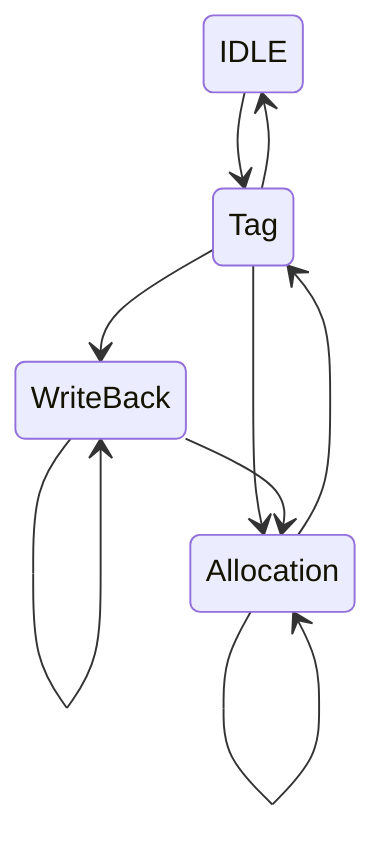

# Cache & Parallelism

In multi-processor architectures there are multiple parallel caches, which have fast communication to keep the data coherent. Multiple difference processes can access and modify the same data.

There must be a way to keep **consistency** and **coherence** of the data in multiple caches.

To solve this problem, there are two strategies: 
- **distributed protocol** which caches use to communicate
- **centralized manager** which handles the interactions

## Cache Controller FSA

Finite State Automaton

The **writes** of **different** processors must be read _in order_.

## Cache Invalidation Protocol

Coherence is when the value I read is the last one written, consistency means that all data is consistent _(calendar - message example)_
