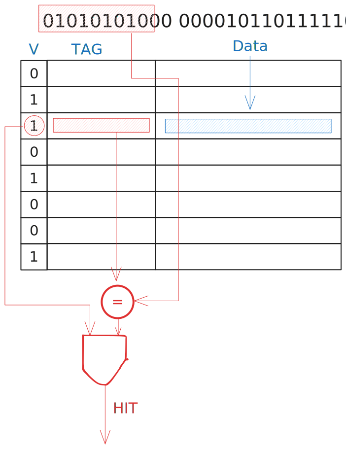
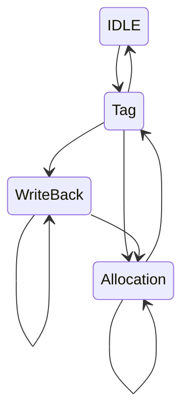

# Cache

A cache is divided into blocks

| line # | valid | tag | block |
|--|--|--|--|
| multiple blocks can have the same line | to determine wether the data is valid | distinguishes a block from the others | the block of data itself |
| 0 | 0 | 101 | 01001001\_11010010 |
| 1 | 1 | 011 | 11001011\_01001100 |
| 2 | 1 | 111 | 11010010\_11001011 |
| 3 | 0 | 000 | 01001100\_00100110 |
| 4 | 1 | 010 | 00100110\_00100110 |

## Direct Mapping

The following is an exmple of a cache with **4 words**, with **2 lines**

| # | word | byte1 | byte2 | byte3 | byte4 |
|--|:--:|--|--|--|--|
| 0 | 0 | 00000000 | 00000000 | 00000000 | 00000000 |
| 0 | 1 | 00000000 | 00000000 | 00000000 | 00000000 |
| 0 | 2 | 00000000 | 00000000 | 00000000 | 00000000 |
| 0 | 3 | 00000000 | 00000000 | 00000000 | 00000000 |
||
| 1 | 0 | 00000000 | 00000000 | 00000000 | 00000000 |
| 1 | 1 | 00000000 | 00000000 | 00000000 | 00000000 |
| 1 | 2 | 00000000 | 00000000 | 00000000 | 00000000 |
| 1 | 3 | 00000000 | 00000000 | 00000000 | 00000000 |

Now let's see how to determine where to get a word in the cache, based on its value _(with 4 word blocks, in a 2 line cache)_.

| tag | line # | word | byte |
|--|--|--|--|
| 000000000000000000001000000 | 0 | 10 | 01 |

To determine a HIT in a cache it's easy _(where multiple words are present in a block, there's the need for a mux to determine which word to get data from)_

### Cache Size

To determine the size of a **direct mapping** cache we need some data:
- \\(2^n\\) lines
- \\(2^m\\) words block size 
- 1 validity bit 

tag size = \\(32 - n - m - 2\\)

cache size in bits = \\(2^n \cdot (2^m + 1 + tag\\_size) \\)

## Associativity

By making the cache more associative, we reduce the number of conflict misses.

### Cache Size pt. 2

> TODO: pdf 22, slide 11

## Policies

### Replacement Policy

- **LRU** _(least recently used)_, it requires a bit to determine how old a block is, to decide which one to replace _(the oldest one)_
- **LFU** _(least frequently used)_, replace the least frequently used, but it requires a more complex hardware _(it requires a counter for each set, the counter is updated at every access)_
- **RANDOM**, replace a random block

### Writing Policy

It's the policy used to update the RAM when the cache is written.

- **Write through**, at each update, the block is updated in **RAM** _(good for consistency on multi-core systems, very slow)_
- **Write back**, the blocks is updated only when replaced, _(faster, but the content in the cache isn't in sync with the content in **RAM**)_

By using a **DIRTY** bit, we can manage to save in **RAM** only blocks which have been changed.

## MISS types

- **Cold start**, when the address is requested for the first time _(solved by making bigger blocks)_
- **Conflict**, when the block has been replaced due to the associativity of the cache _(solved by increasing the associativity)_
- **Capacity**, the block has been replaced due to the size of the cache _(solved by increasing the size of the cache)_

# Cache & Parallelism

In multi-processor architectures there are multiple parallel caches, which have fast communication to keep the data coherent. Multiple difference processes can access and modify the same data.

There must be a way to keep **consistency** and **coherence** of the data in multiple caches.

To solve this problem, there are two strategies: 
- **distributed protocol** which caches use to communicate
- **centralized manager** which handles the interactions

## Cache Controller FSA

Finite State Automaton

The **writes** of **different** processors must be read _in order_.

## Cache Invalidation Protocol

Coherence is when the value I read is the last one written, consistency means that all data is consistent _(calendar - message example)_

# Virtual Memory

In a multi process system, it's hard to manage the memory for all the processes; there could be a problem with memory not being sufficient for all the processes. The solution is to make the addresses of the processes _"virtual"_, and map them to physical ones when needed. 

The memory is divided in **pages**, which are stored on a slower memory when not needed.

Each process has a **page table** which takes a **virtual page** and maps it to a **physical page**.

| valid | dirty | used | physical page address |
|--|--|--|--|
| 1 | 0 | 0 | address in mass memory |
| 1 | 1 | 0 | address in mass memory |
| 0 | 0 | 0 | address in mass memory |
| 1 | 1 | 1 | address in mass memory |

When **valid** is 1, the page is in `RAM`, but you still need **2 accesses** to get the address. When **valid** is 0, the page is in a mass storage, a **page fault** exception is launched, and it requires **millions** of clock cycles to get the data from memory.

## Policies

### Replacement Policy

- **LRU**
- **LFU**
- **RANDOM**

### Writing Policy 

- **Write back** _(because write through requires too much time)_

## TLB

A **Translation Lookaside Buffer** is a special buffer used to access virtual memory addresses faster.
