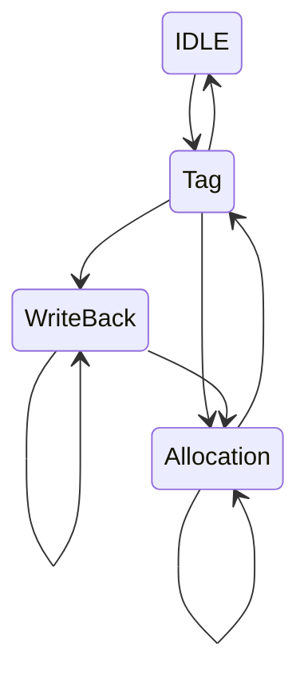

# Cache

A cache is divided into blocks

| line # | valid | tag | block |
|--|--|--|--|
| multiple blocks can have the same line | to determine wether the data is valid | distinguishes a block from the others | the block of data itself |
| 0 | 0 | 101 | 01001001\_11010010 |
| 1 | 1 | 011 | 11001011\_01001100 |
| 2 | 1 | 111 | 11010010\_11001011 |
| 3 | 0 | 000 | 01001100\_00100110 |
| 4 | 1 | 010 | 00100110\_00100110 |

### Direct Mapping

The following is an exmple of a cache with **4 words**, with **2 lines**

| # | word | byte1 | byte2 | byte3 | byte4 |
|--|:--:|--|--|--|--|
| 0 | 0 | 00000000 | 00000000 | 00000000 | 00000000 |
| 0 | 1 | 00000000 | 00000000 | 00000000 | 00000000 |
| 0 | 2 | 00000000 | 00000000 | 00000000 | 00000000 |
| 0 | 3 | 00000000 | 00000000 | 00000000 | 00000000 |
||
| 1 | 0 | 00000000 | 00000000 | 00000000 | 00000000 |
| 1 | 1 | 00000000 | 00000000 | 00000000 | 00000000 |
| 1 | 2 | 00000000 | 00000000 | 00000000 | 00000000 |
| 1 | 3 | 00000000 | 00000000 | 00000000 | 00000000 |

Now let's see how to determine where to get a word in the cache, based on its value _(with 4 word blocks, in a 2 line cache)_.

| tag | line # | word | byte |
|--|--|--|--|
| 000000000000000000001000000 | 0 | 10 | 01 |

To determine a HIT in a cache it's easy _(where multiple words are present in a block, there's the need for a mux to determine which word to get data from)_

#### Cache Size

To determine the size of a **direct mapping** cache we need some data:
- \\(2^n\\) lines
- \\(2^m\\) words block size 
- 1 validity bit 

tag size = \\(32 - n - m - 2\\)

cache size in bits = \\(2^n \cdot (2^m + 1 + tag\\_size) \\)

## Associativity

## Policies

### Replacement Policy

- **LRU** _(least recently used)_, it requires a bit to determine how old a block is, to decide which one to replace _(the one used less recently)_

## Misses

- **Cold start** misses

# Cache & Parallelism

In multi-processor architectures there are multiple parallel caches, which have fast communication to keep the data coherent. Multiple difference processes can access and modify the same data.

There must be a way to keep **consistency** and **coherence** of the data in multiple caches.

To solve this problem, there are two strategies: 
- **distributed protocol** which caches use to communicate
- **centralized manager** which handles the interactions

## Cache Controller FSA

Finite State Automaton

The **writes** of **different** processors must be read _in order_.

## Cache Invalidation Protocol

Coherence is when the value I read is the last one written, consistency means that all data is consistent _(calendar - message example)_

# Virtual Memory
