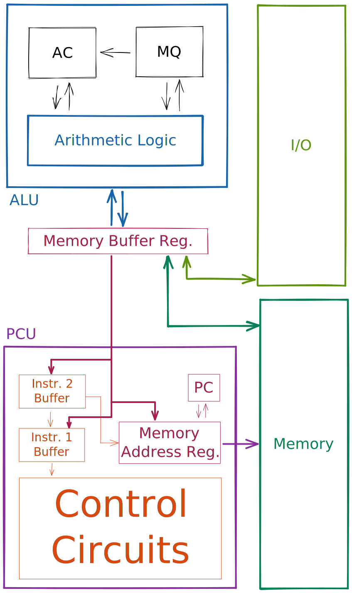

# 1951 IAS Machine Architecture

This section is made to grasp a basic understand of how a computer architecture works, and it's not meant to be studied thoroughly. 

The IAS Machine had a **1000 word** memory, with a **40b word** _(40000b = 5000B ~ 5kB)._ 

## Word

Words are **CA2** integers 

| 0 | 000000000000000000000000000000000000000 |
|--|--|
|\\(\pm 2^{39} \cdot bit\\) | \\(value\\) | 

Instruction words contain two instructions

| 00000000 | 000000000000 | 00000000 | 000000000000 |
|:--:|:--:|:--:|:--:|
| \\(0..7\\) | \\(8..19\\) | \\(20..27\\) | \\(28..39\\) |
| **opcode** | _address_ | **opcode** | _address_ |

## CPU



| | Name | Description |
|:--|:--|:--|
| **MBR** | Memory Buffer Register | receives & sends data to memory and I/O |
| **MAR** | Memory Address Register | current memory address |
| **PC** | Program Counter | address of the instruction to execute | 
| **IR** | Instruction Register | contains instruction to execute | 
| **IBR** | Instruction Buffer Register | contains the second instruction | 
| **AC** | Accumulator | for partial calculation results | 
| **MQ** | Multiplier Quotient | for partial calculation results | 

## Instructions

This isn't the full _ISA_ of the **IAS Machine**, check it out [here](https://www.ecs.csun.edu/~cputnam/Comp546/Stallings/tables/T02-Vertical.pdf).

### Transfer Instructions

| | Description |
|:--|:--|
| **LOAD** | **AC** \\(\leftarrow\\) **AC** `operation` _**Memory**[Address]_  |
| **LOAD** | **AC** \\(\leftarrow\\) `operation` _**Memory**[Address]_  |
| **LDMQ** | **MQ** \\(\leftarrow\\) _**Memory**[Address]_ |
| **ST** | _**Memory**[Address]_ \\(\leftarrow\\) **AC** |
| **AMODL** | _**Memory**[Address][0..11]_ \\(\leftarrow\\) **AC[0..11]** _(low)_ |
| **AMODH** | _**Memory**[Address][20..31]_ \\(\leftarrow\\) **AC[0..11]** _(high)_ |


### Jumps 

Like in modern assembly, jumps can be **unconditional**, **conditional**; for the *IAS machine* you had to specify either a **low** or **high** address.

| | Description |
|:--|:--|
| **UBL** | **PC** \\(\leftarrow\\) _[Address]_ |
| **UBH** | **PC** \\(\leftarrow\\) _[Address]_ + 1 |
| **CBL** | if **AC** \\(\ge\\) 0 { **PC** \\(\leftarrow\\) _[Address]_ } |
| **CBH** | if **AC** \\(\ge\\) 0 { **PC** \\(\leftarrow\\) _[Address]_ + 1 } |


### Operations

| | Description |
|:--|:--|
| **MUL** | **AC**, **MQ** \\(\leftarrow\\) **AC** \\(\cdot\\) _**Memory**[Address]_ |
| **DIV** | **AC** \\(\leftarrow\\) **AC** / _**Memory**[Address]_
| **DIV** | **MQ** \\(\leftarrow\\) **AC** % _**Memory**[Address]_|
| **LSHIFT** | **AC**, **MQ** \\(\leftarrow\\) **AC**, **MQ** << ***X*** |
| **RSHIFT** | **AC**, **MQ** \\(\leftarrow\\) **AC**, **MQ** >> ***X*** |
| **MOVE** | **AC** \\(\leftarrow\\) **AC** `operation` **MQ** |
| **IO** | Transfer from and to I/O devices |

## Example Program

```armasm
LOAD 101
ADD 102
ST 103
```

### How does it work?

1. **Fetch**
    - MAR \\(\leftarrow\\) PC 
    - IR, IBR \\(\leftarrow\\) MBR \\(\leftarrow\\) Memory[MAR]
2. **Decode**
    - MAR \\(\leftarrow\\) IR[8..19] ; _address_
    - CU \\(\leftarrow\\) IR[0..8] ; _opcode_
3. **Exec**
    - AC \\(\leftarrow\\) MBR \\(\leftarrow\\) Memory[101]
4. **Decode**
    - MAR \\(\leftarrow\\) IBR[8..19] ; _address_
    - CU \\(\leftarrow\\) IBR[0..8] ; _opcode_
5. **Exec**
    - AC \\(\leftarrow\\) AC + MBR \\(\leftarrow\\) Memory[102]
6. **PC**
    - PC \\(\leftarrow\\) PC + 1
7. **Fetch**
    - MAR \\(\leftarrow\\) PC 
    - IR, IBR \\(\leftarrow\\) MBR \\(\leftarrow\\) Memory[MAR]
8. **Decode**
    - MAR \\(\leftarrow\\) IR[8..19] ; _address_
    - CU \\(\leftarrow\\) IR[0..8] ; _opcode_
9. **Exec**
    - Memory[103] \\(\leftarrow\\) MBR \\(\leftarrow\\) AC


