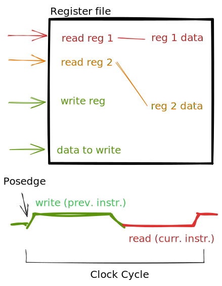

# Pipeline

> TODO Pipelined architecture drawing
> TODO Pipelined architecture drawing with branching

We can divide the execution of an instruction into phases:

- **Fetch**: load instruction from memory
- **Instruction decode**: **CU** decodes instruction into signals, and values are read from **registers**
- **Execution**: the **ALU** does the operation, or the access to **memory** or the **branch**
- **Memory Access**: memory is read or written _(`lw`, `sw`)_
- **Write Back**: the result of the **ALU** operation, or the **Memory** operation is put in the **write register**

In each moment in time, in a **single clock cycle** architecture, **80%** of the **CPU** isn't working _(only one operation is executed at a time)_. With a **pipeline** we can solve this problem by doing an instruction step by step, so in each phase there's a different instruction. 

### Register File and Clock

The read and write of the **register file** happen during the same clock cycle. It's basically a latch that writes _(the previous instruction)_ when the clock is 1, and reads the values in the register is 0.



## Hazard

There are various hazards that can present on a pipelined architecture, which don't happen on a single clock cycle architecture, because we are executing multiple instructions at the same time, without waiting for the previous ones to finish. 

There are three types of hazards:

- **Structural Hazards**: hardware resources aren't enough _(if the instruction memory and data memory are the same, there could be collision in the instruction fetch phase, and mem phase)_; these are solved during design.
- **Data Hazards**: if the required data isn't ready yet.
- **Control Hazards**: a jump changes the flow of the instructions' execution.

Let's look at an example:

```armasm
add $s0, $t0, $t1
sub $t2, $s0, $t3 
```

Let's see what happens if we use a pipeline!

||||||||
|--|--|--|--|--|--|--|
| add | IF | ID | EX | ME | **WB** | |
| sub | | IF | **ID** | EX | ME | WB |

The above alignment doesn't work, because during the `ID` of the `sub` instruction, we read an old value of `$s0`, which hasn't been updated with the `WB`.

|||||||||
|--|--|--|--|--|--|--|--|
| add | IF | ID | EX | ME | **WB** | | |
| sub | | \\(\rightarrow\\) | IF | **ID** | EX | ME | WB |

The same happens here: while the add instruction is still waiting for the **memory access**, we try to read the value `$s0`, which still hasn't been updated with the `WB` phase.

||||||||||
|--|--|--|--|--|--|--|--|--|
| add | IF | ID | EX | ME | **WB** | | | |
| sub | | \\(\rightarrow\\) | \\(\rightarrow\\) | IF | **ID** | EX | ME | WB |

This is a valid configuration! As we can see [here](./#register-file-and-clock), the `WB` phase happens before the `ID` phase, during the same clock cycle, so we can run these phases of the two instructions at the same time.

### Bypassing/Forwarding

In some cases, like this one, the required value could be in the pipeline before the `WB` phase: in the example above, the new value in `$s0` is available right after the `EX` phase, after the **ALU** does the operation, and we don't have to wait for a `MEM` phase. In this case, we can build a **shortcut** between the result of the ALU, and one of the parameters of the ALU in the next clock cycle. To do this, we have to first **detect** when we actually need this behaviour.

With such a shortcut, we don't need to wait for the `WB`.

||||||||
|--|--|--|--|--|--|--|
| add | IF | ID | **EX** | ME | WB | |
| sub | | IF | ID | **EX** | ME | WB |

### Bubble

In some cases, shortcuts can't be used, so we have to wait one or two instructions before continuing with the next instructions. To wait 1 cycle, we add a **bubble**, which is an empty instruction, a `nop` _(all 0 values, doesn't affect the registers and memory; it's a valid instruction)_

### Instruction Rearrangement

Sometimes, by rearranging the instructions, we can solve some of these **hazards**. Let's look at an example.

```armasm
lw $t1, 0($t0)
lw $t2, 4($t0)
add $t3, $t1, $t2
sw $t3, 12($t0)
lw $t4, 8($t0)
add $t5, $t1, $t4
sw $t5, 16($t0)
```

> TODO: complete example

### Control Hazard

```armasm
beq $t0, $t1, else
    lw $s1, ($s1)
else:
    ori $s1, $s1, 10
```

In this case, we might need to discard the `lw` instruction which was loaded before jumping to the `ori` instruction.To make sure the program executes correctly, we can insert two `nop` instructions, that way, while we run the branch instruction, and we wait for the `EXE` to calculate the jump, we load 2 empty instruction which don't change the state of the CPU _(these are called "bubbles")_.

```armasm
beq $t0, $t1, else
    nop
    nop
    lw $s1, ($s1)
else:
    ori $s1, $s1, 10
```

If we can predict the jump in the `ID` phase, we need just 1 `nop`. It doesn't always work like this, as in some loops, we actually jump just at the end. In that case, the `jump` is never executed, and we can **load the next instruction instead** of a `nop`:

```armasm
.data
    array: .word 1, 5, 8, 7, 6
    size: .word 5
.text
    xor $t1, $t1, $t1 #; i = 0
    sub $s1, $s1, $s1 #; s = 0
    lw $s7, size #; load size into register
    sll $s7, $s7, 2 #; multiply $s7 by 4 (due to word size)

    while: 
        bge $t1, $s7, whileEnd #; if i >= size { jump to end }
        lw $t2, array($t1) # load array[i]; bge is true only once!
        add $s0, $s0, $t2 # s += array[i]

        addi $t1, $t1, 4 #; i += 1
        j while
    whileEnd:
```

That's why the **CPU** tries to **predict the branch**, and tries to load the next instruction or the `nop` depending on which is executed most often.


### Data Hazard

### Forwarding Unit 

#### EXE

#### MEM 

> TODO: CPU with forwarding

### Branch Prediction

## Control Signals Propagation

## Speed Increment

## Exercise

> TOOD Full Pipelined architecture
