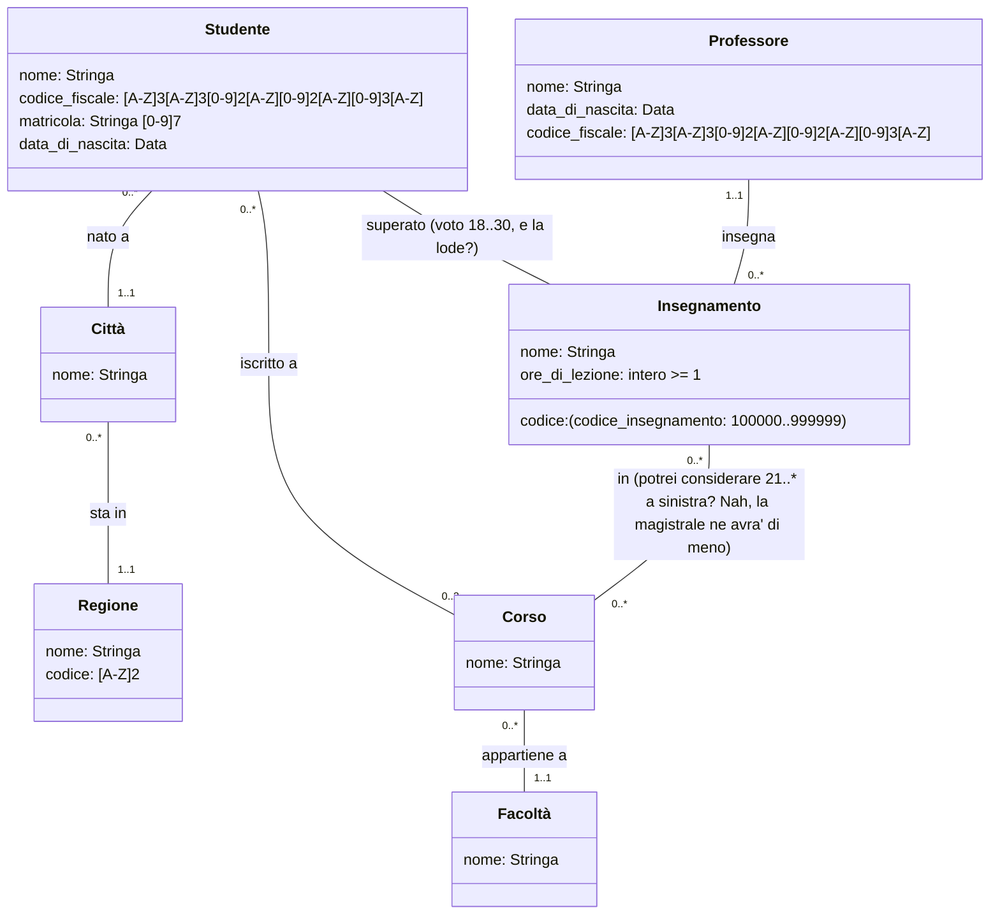

# Accademia 1

## Requisiti

I dati di interesse per il sistema sono i docenti universitari, i progetti di ricerca e le attività dei docenti.

Di ogni docente interessa conoscere il nome, il cognome, la data di nascita, la matricola, la posizione universitaria (ricercatore, professore associato, professore ordinario) e i progetti ai quali partecipa.

Dei progetti interessa il nome, un acronimo, la data di inizio, la data di fine e i docenti che vi partecipano.

Un progetto è composto da molti Work Package (WP). Oltre al progetto a cui fa riferimento, del WP interessa sapere il nome, la data di inizio e la data di fine.

Il sistema deve permettere ai docenti di registrare impegni di diverso tipo. 

Degli impegni interessa sapere il giorno in cui avvengono, la durata in ore e la tipologia di impegno con relativa motivazione.

### 1. Docenti
    1.1 nome
    1.2 cognome
    1.3 data di nascita

### 2. Progetti di ricerca

### 3. Attività dei docenti

## UML

