# Accademia 1

## Requisiti

I dati di interesse per il sistema sono i docenti universitari, i progetti di ricerca e le attività dei docenti.

Di ogni docente interessa conoscere il nome, il cognome, la data di nascita, la matricola, la posizione universitaria (ricercatore, professore associato, professore ordinario) e i progetti ai quali partecipa.

Dei progetti interessa il nome, un acronimo, la data di inizio, la data di fine e i docenti che vi partecipano.

Un progetto è composto da molti Work Package (WP). Oltre al progetto a cui fa riferimento, del WP interessa sapere il nome, la data di inizio e la data di fine.

Il sistema deve permettere ai docenti di registrare impegni di diverso tipo. 

Degli impegni interessa sapere il giorno in cui avvengono, la durata in ore e la tipologia di impegno con relativa motivazione.

Devo mettere gli ID!

### Docenti
- nome
- cognome
- data di nascita
- matricola {id}
- posizione universitaria 
    - ricercatore
    - professore associato
    - professore ordinario
- progetti a cui partecipa (più di 1)
- impegni (più di 1?)

### Progetti di ricerca
- nome
- acronimo [A-Z]{10}? {id?} 
- data inizio
- data fine (opzionale? [0..1])
- i docenti che vi partecipano (più di 1)

### Work Package
- nome
- progetto di cui fanno parte
- data inizio
- data fine (opzionale? [0..1])

### Attività 
- impegni di diverso tipo?
- giorno
- durata in ore
- motivazione

### Tipologia
- Mi aspetto che il professore scelga la tipologia da un elenco prefissato dall'università, quindi lo tengo in una classe separata

## UML

```mermaid
classDiagram
    class Docente {
        nome: Stringa
        cognome: Stringa
        data_di_nascita: Data
        posizione: ["ricercatore", "professore associato",  "professore ordinario"]
    }
    Docente : matricola&#58 [A-Z0-9]{10} {id}
    class Docente["Docente 👨‍🏫"]

    class Progetto {
        acronimo: [A-Z]+
    }
    class Progetto["Progetto di ricerca 🏗️"]

    class WP {
        nome: Stringa
        data_inizio: Data
        data_fine: Data [0..1]
    }
    class WP["Work Package 📦"]

    class Attivita {
        giorno: Data,
        durata_ore: intero > 0,
    }
    class Attivita["Attività ⌚"]

    class Tipologia {
        nome: Stringa
    }

    Docente "0..*" -- "0..*" Progetto : partecipa_a
    Docente "1..1" -- "0..*" Attivita : ha_un
    WP "0..*" -- "1..1" Progetto : fa_parte_di
    WP <|-- Progetto
    Attivita "0..*" -- "1..1" Tipologia : di_tipo `(motivazione Stringa)`
```

<!-- class Progetto { -->
<!--     nome: Stringa -->
<!--     acronimo: [A-Z]+ -->
<!--     data_inizio: Data -->
<!--     data_fine: Data [0..1] -->
<!-- } -->

<!-- ### Docenti -->
<!-- - [x] nome -->
<!-- - [x] cognome -->
<!-- - [x] data di nascita -->
<!-- - [x] matricola -->
<!-- - [x] posizione universitaria  -->
<!--     - ricercatore -->
<!--     - professore associato -->
<!--     - professore ordinario -->
<!-- - [x] progetti a cui partecipa (più di 1) -->
<!-- - [x] impegni (0 o più) -->
<!---->
<!-- ### Progetti di ricerca -->
<!-- - [x] nome -->
<!-- - [x] acronimo [A-Z]{10}? -->
<!-- - [x] data inizio -->
<!-- - [x] data fine (opzionale? [0..1], potrebbe non essere ancora finito) -->
<!-- - [x] i docenti che vi partecipano (0 o più) -->
<!---->
<!-- ### Work Package -->
<!-- - [x] nome -->
<!-- - [x] progetto di cui fanno parte -->
<!-- - [x] data inizio -->
<!-- - [x] data fine (opzionale? [0..1]) -->
<!---->
<!-- ### Impegni  -->
<!-- - [x] impegni di diverso tipo? -->
<!-- - [x] giorno -->
<!-- - [x] durata in ore -->
<!-- - [x] motivazione -->
