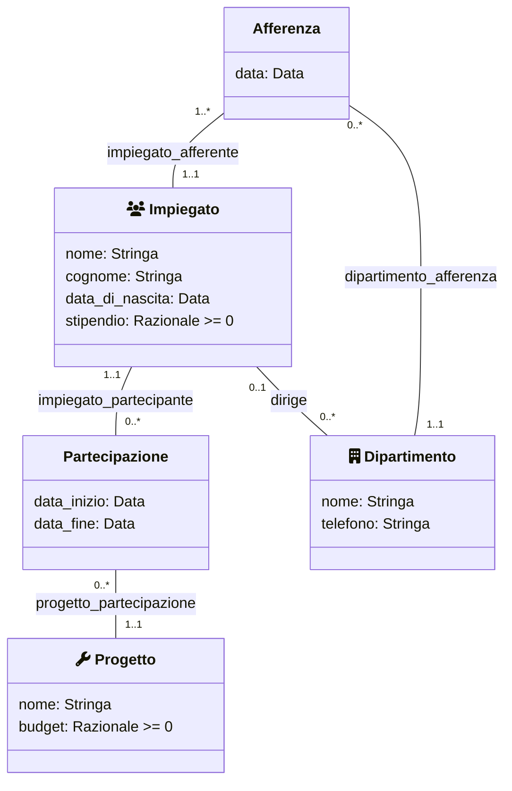
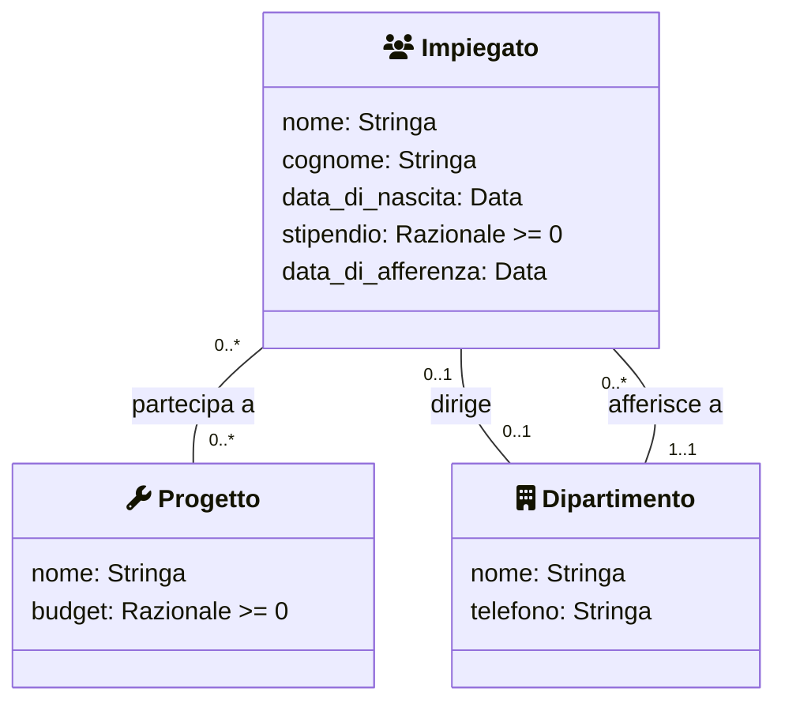

# Azienda 1

Si vuole sviluppare un sistema informativo per la gestione dei dati sul personale di una certa azienda costituita da diversi dipartimenti. Durante la fase di raccolta dei requisiti è stata prodotta la specifica dei requisiti mostrata di seguito. Si chiede di iniziare la fase di Analisi dei requisiti ed in particolare di:

1. raffinare la specifica dei requisiti eliminando _inconsistenze_, _omissioni_ o _ridondanze_ e produrre un elenco numerato di requisiti il meno ambiguo possibile
2. produrre un diagramma UML delle classi concettuale che modelli i dati di interesse, utilizzando solo i costrutti di `classe`, `associazione`, `attributo`

## Requisiti

I dati di interesse per il sistema sono **impiegati**, **dipartimenti**, **direttori** dei dipartimenti e **progetti** aziendali.

- Di ogni impiegato interessa conoscere il _nome_, il _cognome_, la _data di nascita_ e lo _stipendio_ attuale, il **dipartimento** al quale afferisce _(esattamente uno, con la rispettiva data di afferenza)_.

- Di ogni **dipartimento** interessa conoscere il _nome_, il numero di _telefono_ del centralino

<!-- , e la data di afferenza di ognuno degli impiegati che vi lavorano. -->

- Di ogni **dipartimento** interessa conoscere inoltre il _direttore_, che è uno degli impiegati dell’azienda.

<!-- Il direttore afferisce al dipartimento che dirige, e, visto che il direttore è un impiegato, può afferire ad un solo dipartimento -->

- Il sistema deve permettere di rappresentare i **progetti** aziendali nei quali sono _coinvolti_ i diversi **impiegati**.

- Di ogni **progetto** interessa il _nome_ ed il _budget_.

- Ogni **impiegato** può partecipare ad un numero qualsiasi di **progetti**.

## UML _(opzione 1)_

### Osservazioni

Questa è l'opzione più _"complessa"_

- Un dipartimento non deve avere per forza un dirigente assegnato _(quindi `0..1`)_
- Un impiegato può dirigere più dipartimenti _(non afferisce al dipartimento che dirige, ci potrebbe essere un dipartimento apposta per i dirigenti, quindi `0..*`)_
- La classe `Afferenza` ci serve per tenere uno storico dei dipartimenti in cui ha lavorato un impiegato
- Usiamo la classe `Partecipazione` per i progetti perché un impiegato può lavorare ad un progetto più volte in periodi diversi di tempo _(N.B. è fondamentale avere come attributi `data_inizio` e `data_fine`, altrimenti l'utilizzo della classe non regge in questo contesto)_
- Usare il tipo `Stringa` per l'attributo `telefono` non va bene, ma la soluzione originale lo includeva e preferisco attenermi a quella

## UML _(opzione 2)_

### Osservazioni

Questa è l'opzione più _"minimale"_

- Un dipartimento non deve avere per forza un dirigente assegnato _(quindi `0..1`)_
- Un impiegato può dirigere al più un dipartimento
- L'impiegato afferisce ad un solo dipartimento, quindi possiamo mettere la `data_di_afferenza` come attributo dell'impiegato
- Un dipendente o partecipa ad un determinato progetto o non vi partecipa, la relazione è binaria e non serve una classe
- Usare il tipo `Stringa` per l'attributo `telefono` non va bene, ma la soluzione originale lo includeva e preferisco attenermi a quella

