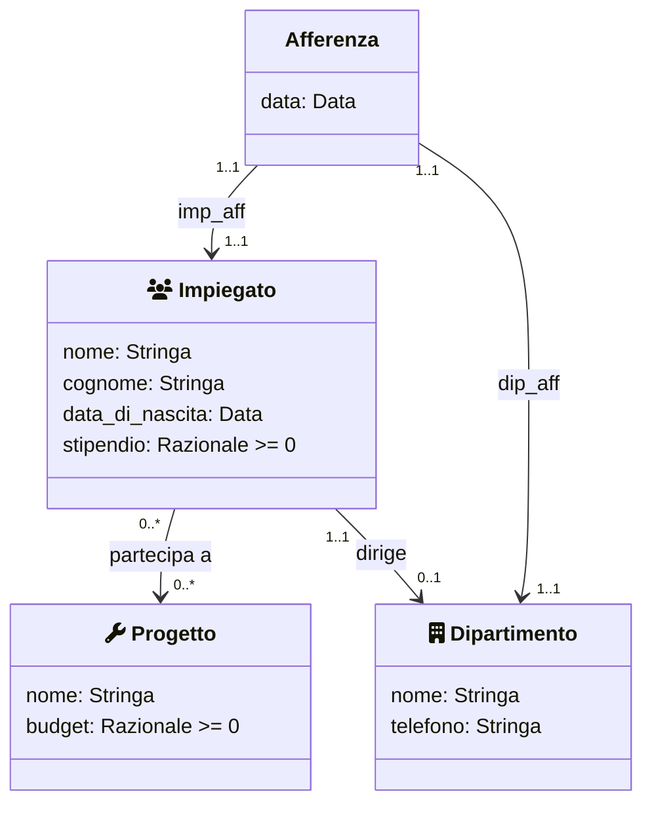
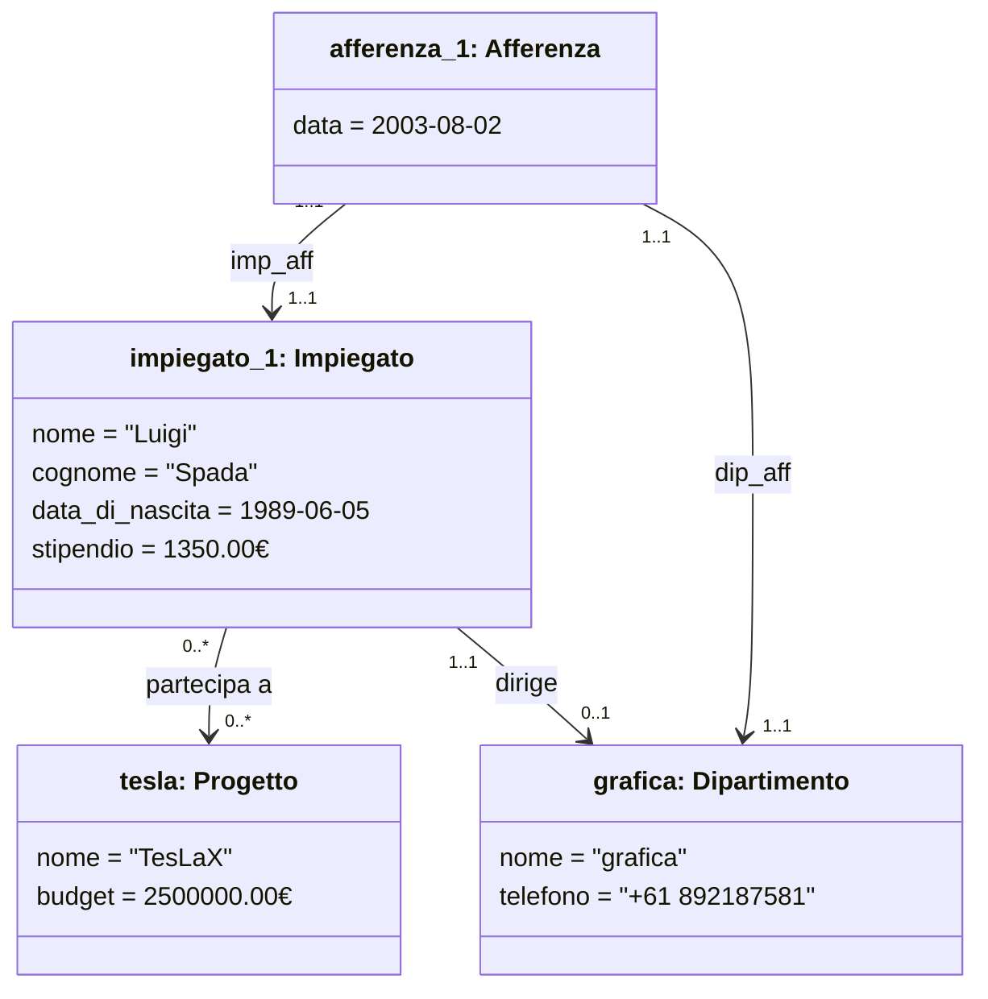

# Azienda 1

Si vuole sviluppare un sistema informativo per la gestione dei dati sul personale di una certa azienda costituita da diversi dipartimenti. Durante la fase di raccolta dei requisiti è stata prodotta la specifica dei requisiti mostrata di seguito. Si chiede di iniziare la fase di Analisi dei requisiti ed in particolare di:

1. raffinare la specifica dei requisiti eliminando _inconsistenze_, _omissioni_ o _ridondanze_ e produrre un elenco numerato di requisiti il meno ambiguo possibile
2. produrre un diagramma UML delle classi concettuale che modelli i dati di interesse, utilizzando solo i costrutti di `classe`, `associazione`, `attributo`

## Requisiti

I dati di interesse per il sistema sono **impiegati**, **dipartimenti**, **direttori** dei dipartimenti e **progetti** aziendali.

- Di ogni impiegato interessa conoscere il _nome_, il _cognome_, la _data di nascita_ e lo _stipendio_ attuale, il **dipartimento** al quale afferisce _(esattamente uno, con la rispettiva data di afferenza)_.

- Di ogni **dipartimento** interessa conoscere il _nome_, il numero di _telefono_ del centralino

<!-- , e la data di afferenza di ognuno degli impiegati che vi lavorano. -->

- Di ogni **dipartimento** interessa conoscere inoltre il _direttore_, che è uno degli impiegati dell’azienda.

<!-- Il direttore afferisce al dipartimento che dirige, e, visto che il direttore è un impiegato, può afferire ad un solo dipartimento -->

- Il sistema deve permettere di rappresentare i **progetti** aziendali nei quali sono _coinvolti_ i diversi **impiegati**.

- Di ogni **progetto** interessa il _nome_ ed il _budget_.

- Ogni **impiegato** può partecipare ad un numero qualsiasi di **progetti**.

## Diagramma

<!-- namespace Istanze { -->
<!-- 	class impiegato_1 { -->
<!-- 		nome = "Luigi" -->
<!-- 		cognome = "Spada" -->
<!-- 		data_di_nascita = 1989-06-05 -->
<!-- 		stipendio = 1350.00€ -->
<!-- 	} -->
<!-- 	class impiegato_1["impiegato_1: Impiegato"] -->
<!---->
<!-- 	class afferenza_1 { -->
<!-- 		data = 2003-08-02 -->
<!-- 	} -->
<!-- 	class afferenza_1["afferenza_1: Afferenza"] -->
<!---->
<!-- 	class dipartimento_1 { -->
<!-- 		nome = "grafica" -->
<!-- 		telefono = "+61 892187581" -->
<!-- 	} -->
<!-- 	class dipartimento_1["grafica: Dipartimento"] -->
<!---->
<!-- 	class progetto_1 { -->
<!-- 		nome = "TesLaX" -->
<!-- 		budget = 2500000.00€ -->
<!-- 	} -->
<!-- 	class progetto_1["tesla: Progetto"] -->
<!-- } -->

<!-- impiegato_1 ..> Impiegato : <i><< istanza di >></i> -->
<!-- dipartimento_1 ..> Dipartimento : <i><< istanza di >></i> -->
<!-- progetto_1 ..> Progetto : <i><< istanza di >></i> -->
<!-- afferenza_1 ..> Afferenza : <i><< istanza di >></i> -->

## Istanze

<!-- afferenza_1 --|> impiegato_1 : impiegato_afferenza -->
<!-- afferenza_1 --|> dipartimento_1 : dipartimento_afferenza -->
<!-- impiegato_1 --|> dipartimento_1 : dirige -->
<!-- impiegato_1 --|> progetto_1 : partecipa a -->

