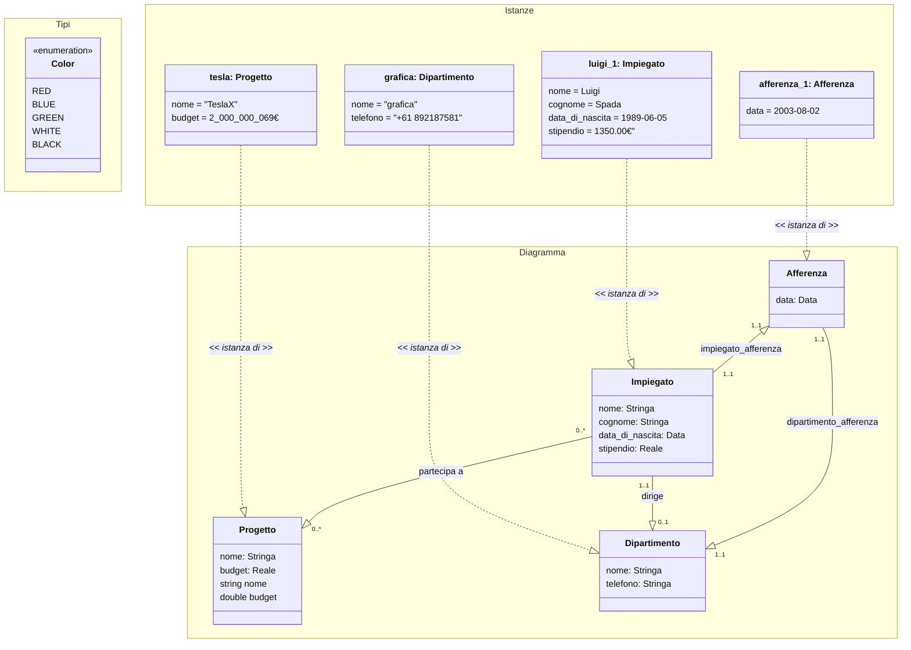

Si vuole sviluppare un sistema informativo per la gestione dei dati sul personale di una
certa azienda costituita da diversi dipartimenti. Durante la fase di raccolta dei requisiti
è stata prodotta la specifica dei requisiti mostrata di seguito.
Si chiede di iniziare la fase di Analisi dei requisiti ed in particolare di:
1. raffinare la specifica dei requisiti eliminando inconsistenze, omissioni o ridondanze
e produrre un elenco numerato di requisiti il meno ambiguo possibile
2. produrre un diagramma UML delle classi concettuale che modelli i dati di interesse,
utilizzando solo i costrutti di classe, associazione, attributo.

I dati di interesse per il sistema sono impiegati, dipartimenti, direttori dei dipartimenti e progetti aziendali.

Di ogni impiegato interessa conoscere il nome, il cognome, la data di nascita e lo stipendio attuale, il dipartimento (esattamente uno) al quale afferisce.

Di ogni dipartimento interessa conoscere il nome, il numero di telefono del centralino, e la data di afferenza di ognuno degli impiegati che vi lavorano.

Di ogni dipartimento interessa conoscere inoltre il direttore, che è uno degli impiegati dell’azienda.

Il sistema deve permettere di rappresentare i progetti aziendali nei quali sono coinvolti i diversi impiegati.

Di ogni progetto interessa il nome ed il budget.

Ogni impiegato può partecipare ad un numero qualsiasi di progetti.

