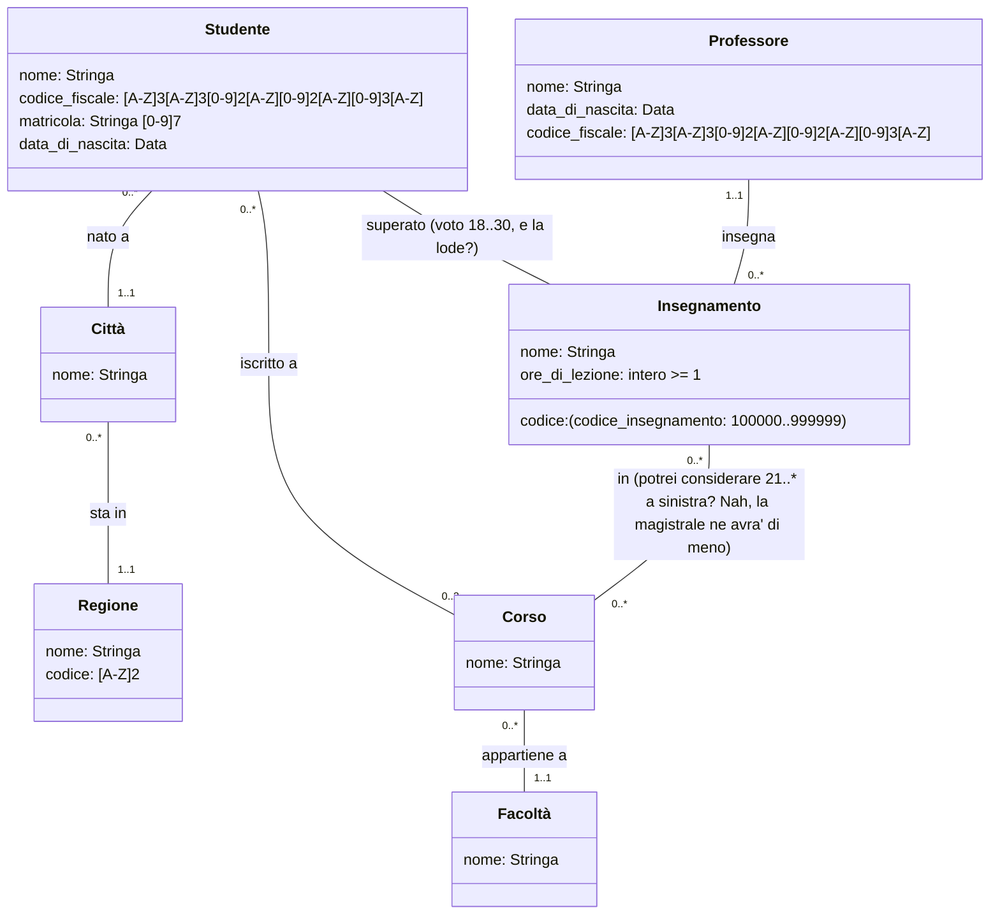

# Università 1

## Requisiti

I dati di interesse per il sistema sono studenti, facoltà, professori e corsi.

- Di ogni studente interessa conoscere il nome, il codice fiscale, il numero di matricola, la data di nascita, il luogo di nascita (città e regione), il corso di laurea a cui è iscritto (con l’anno di iscrizione), e gli insegnamenti di cui ha superato l’esame.

- Dei professori interessa il nome, la data di nascita, il codice fiscale, il luogo di nascita e gli insegnamenti erogati.

- Dei corsi di laurea interessa il nome e la o le facoltà di appartenenza. Di queste ultime interessa il nome.

- Di ogni insegnamento interessa il codice, il nome, il numero di ore di lezione, e i corsi di laurea a cui appartiene.

### Studente

- nome _("Paperopoli" pare lecito qui)_
- codice fiscale _(nome [A-Z]{3}, cognome [A-Z]{3}, anno [0-9]{2}, mese [A-Z]{1}, giorno [0-9]{2}, comune [A-Z][0-9]{3}, codice_controllo [A-Z])_ [per pedanti](https://www.studioaleo.it/struttura-codice-fiscale.html)
- matricola (Stringa [0-9]{7})
- data di nascita (all my fellas be born after 1400?)
- luogo di nascita
- corso di laurea a cui è iscritto con anno di iscrizione _(all my fellas be iscritti a più di un corso di laurea, ovvero 2 [lo dice il Gov](https://www.mur.gov.it/it/news/lunedi-01082022/doppia-laurea-iscrizione-due-corsi-di-studio-gia-dallanno-accademico-2022-2023))_
- insegnamenti superati con voto

_(prima account su infostud, e solo dopo iscrizione ad un corso)_

### Insegnamento

- codice 100000..999999
- nome
- corsi di appartenenza
- ore di lezione intero > 0

### Corso

- nome
- facoltà di appartenenza

### Facoltà

- nome

### Professore

- nome _("X Æ A-12" pare lecito qui)_
- codice fiscale _(stessa pappardella di sopra)_
- data di nascita
- luogo di nascita
- insegnamenti erogati

## UML

