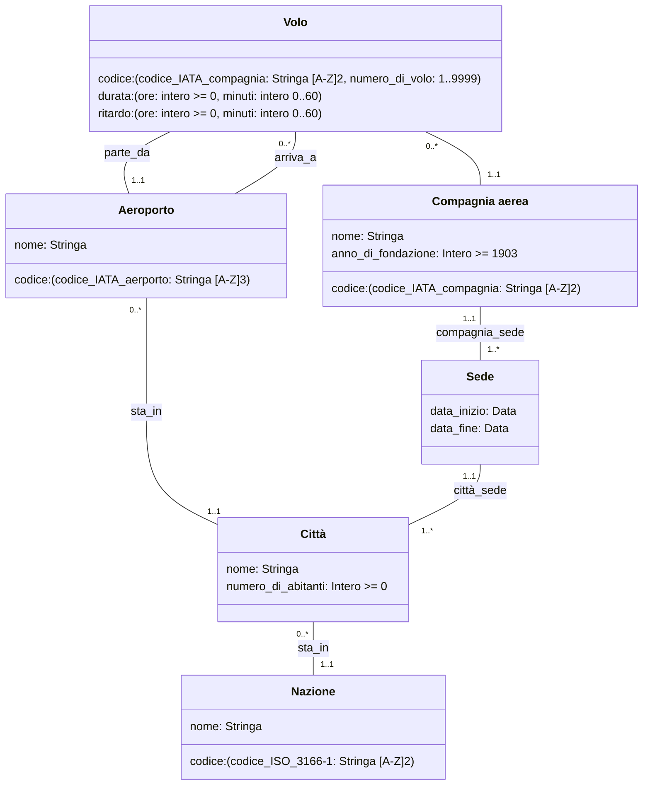

# Voli Aerei 1

## Requisiti 

I dati di interesse per il sistema sono voli, compagnie aeree ed aeroporti.

- Dei voli interessa rappresentare codice, durata, compagnia aerea ed aeroporti di partenza e arrivo.
- Degli aeroporti interessa rappresentare codice, nome, città (con nome e numero di abitanti) e nazione.
- Delle compagnie aeree interessa rappresentare nome, anno di fondazione, e la città in cui ha sede la direzione.

> TODO: durata minima di un volo
> durata: [(ore: intero >= 1, minuti: intero >= 0), (ore: intero >= 0, minuti: intero >= 1)]
> compagnia aerea più vecchia? 1912 tecnicamente, ma mettiamo 1906, se gli aerei non esistono, non possono esistere le compagnie aere

### Volo

- codice, composto dalle 2 lettere della compagnia, dal numero di volo _(questo numero può variare da 1 a [4 cifre](https://it.wikipedia.org/wiki/Numero_di_volo) e serve a distinguere ogni volo gestito dalla compagnia aerea)_
- duarata _(vedere tabella sotto)_
- compagnia aerea
- aeroporto di partenza
- aeroporto di arrivo
- **non** interessano i posti disponibili, dato che non è una delle metriche di cui la IATA tiene traccia
- potrebbe interessare il **ritardo**

Una classificazione arbitraria della [durata di un volo](https://it.wikipedia.org/wiki/Lunghezza_di_un_volo#Voli_a_corto_raggio) secondo Wikipedia

| tipo di volo | durata |
|--|--|
| corto raggio | meno di 3 ore _(internazionale)_ |
| medio raggio | da 3 a 6 - 8 ore |
| lungo raggio | da 6 a 12 ore |
| ultra-lungo raggio | più di 12 ore |

Il volo più lungo è stato di circa 20 ore, ma non è importante dare un limite massimo alla durata di un volo 

### Aeroporto

- nome _("Paperopoli" pare lecito qui)_
- codice, qui useremo il [Il codice aeroportuale IATA](https://it.wikipedia.org/wiki/Codice_aeroportuale_IATA) _("Paperopoli" qui **non** va decisamente bene)_, una stringa lunga 3 di lettere maiuscole
- città, perché sì
- nazione, perché sì

### Compagnia aerea 

- nome _("Paperopoli" pare lecito qui)_
- codice [IATA](https://www.uniquevisitor.it/magazine/codici-voli-compagnie-aeree.php) di 2 lettere!
- anno di fondazione dopo il [1903](https://www.corriere.it/tecnologia/23_dicembre_17/il-primo-volo-dei-fratelli-wright-ha-decollato-120-anni-fa-e-duro-solo-12-secondi-f737b3c3-be79-475b-89c2-de129a206xlk.shtml), se vogliamo essere pedanti [1909](https://it.wikipedia.org/wiki/Compagnia_aerea#DELAG,\_la_prima_compagnia_aerea_del_mondo)
- sede _(tecnicamente può cambiare, e vogliamo tenere lo storico)_

### Città

- nome _("Paperopoli" pare lecito qui)_
- numero di abitanti _(si spera più di 0? Immagina avere -10 abitanti, LOL)_
- possibilmente una nazione?

### Nazione

- nome
- codice [ISO 3166-1](https://it.wikipedia.org/wiki/ISO_3166-1)

## Osservazioni

- Non sono pedante sulla durata minima del volo, perché si suppone che la imposti un utente autorizzato _(e autenticato!)_
- Una città può avere 0 aeroporti, perché magari è la sede di una qualche compagnia
- Ho messo lo storico delle sedi legali delle compagnie per essere mettere più funzionalità possibili

## UML

