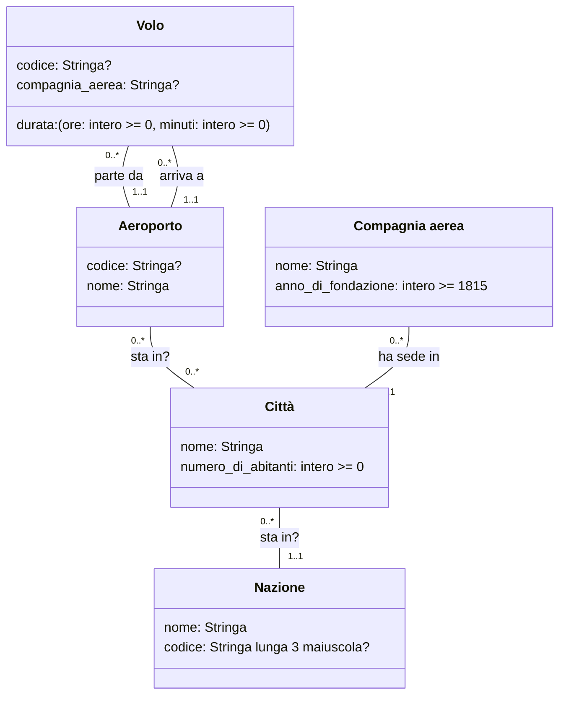

# Voli Aerei 1

## Requisiti 

I dati di interesse per il sistema sono voli, compagnie aeree ed aeroporti.

- Dei voli interessa rappresentare codice, durata, compagnia aerea ed aeroporti di partenza e arrivo.
- Degli aeroporti interessa rappresentare codice, nome, città (con nome e numero di abitanti) e nazione.
- Delle compagnie aeree interessa rappresentare nome, anno di fondazione, e la città in cui ha sede la direzione.

> TODO: durata minima di un volo
> durata: [(ore: intero >= 1, minuti: intero >= 0), (ore: intero >= 0, minuti: intero >= 1)]
> compagnia aerea più vecchia?

## UML

