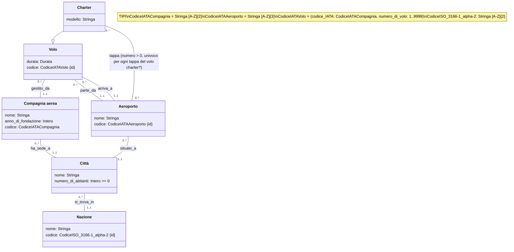

# Voli Aerei 2 

## Requisiti

I dati di interesse per il sistema sono voli, compagnie aeree ed aeroporti.

Dei voli interessa rappresentare codice, durata, compagnia aerea ed aeroporti di partenza e arrivo.

Degli aeroporti interessa rappresentare codice, nome, città (con nome e numero di abitanti) e nazione.

Delle compagnie aeree interessa rappresentare nome, anno di fondazione, e la città in cui ha sede la direzione.

Un tipo particolare di voli sono voli charter. 

Questi possono prevedere tappe intermedie in aeroporti. 

Delle tappe intermedie di un volo charter interessa mantenere l’ordine con cui esse si susseguono (ad esempio, un certo volo che parte da “Milano Linate” e arriva a “Palermo Punta Raisi”, prevede tappe intermedie prima nell’aeroporto di Bologna e poi in quello di Napoli). 

Dei voli charter interessa rappresentare anche il modello di velivolo usato.

### Volo

- codice, composto dalle 2 lettere della compagnia, dal numero di volo _(questo numero può variare da [1 a 4 cifre](https://it.wikipedia.org/wiki/Numero_di_volo) e serve a distinguere ogni volo gestito dalla compagnia aerea)_ {id}
- duarata
- compagnia aerea
- aeroporto di partenza
- aeroporto di arrivo

### Aeroporto

- nome _("Paperopoli" pare lecito qui)_
- codice, qui useremo il [Il codice aeroportuale IATA](https://it.wikipedia.org/wiki/Codice_aeroportuale_IATA) [A-Z]{3} {id}
- città
- nazione

### Compagnia aerea 

- nome _("Paperopoli" pare lecito qui)_
- codice [IATA](https://www.uniquevisitor.it/magazine/codici-voli-compagnie-aeree.php) di 2 lettere {id}
- anno di fondazione dopo il [1903](https://www.corriere.it/tecnologia/23_dicembre_17/il-primo-volo-dei-fratelli-wright-ha-decollato-120-anni-fa-e-duro-solo-12-secondi-f737b3c3-be79-475b-89c2-de129a206xlk.shtml), se vogliamo essere pedanti [1909](https://it.wikipedia.org/wiki/Compagnia_aerea#DELAG,\_la_prima_compagnia_aerea_del_mondo)
- sede _(città, non teniamo lo storico)_

## Voli

### Città

- nome
- numero di abitanti >= 0 
- nazione 

### Nazione
- nome
- codice [ISO 3166-1](https://it.wikipedia.org/wiki/ISO_3166-1), stringa lunga 2

### Voli Charter
- tappe intermedie in aeroporti
- modello di velivolo

### Tappe
- mantenere l'ordine con cui si susseguono
- “Milano Linate” e arriva a “Palermo Punta Raisi”, prevede tappe intermedie prima nell’aeroporto di Bologna e poi in quello di Napoli

## UML

