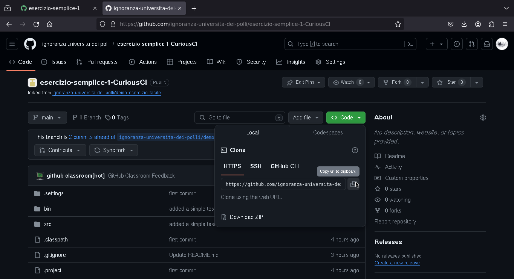

# Un'occhiata veloce a GitHub Classroom 

Sarò molto sintetico, solo per dare un'idea di come funzionano gli esercizi e il feedback agli studenti

## Home 

## Creare una "Classroom" 

Per creare una "Classroom" bisogna selezionare l'organizzazione nella quale si vogliono mettere i repository (si quelli con le soluzioni degli studenti, sia i template con i test)

Una possibile organizzazione per il corso potrebbe essere "Metodologie di programmazione Sapienza"

Passiamo direttamente alle informazioni importanti

## Amministratori della "Classroom"

Si può usare un link d'invito per decidere i docenti (amministratori) del corso 

## Assegnare esercizi

Una volta creata la "Classroom", questa è l'interfaccia di gestione dei degli esercizi 

### Individuale, di gruppo, pubblico o privato (scadenza opzionale)

Per assegnare un esercizio bisogna dare alcune informazioni di base: il nome, un'eventuale scadenza (opzionale), se si tratta di un esercizio di gruppo o individuale.

Quando lo studente "accetterà l'esercizio", verrà creato un repository (pubblico o privato) con il nome dell'esercizio e dello studente nell'organizzazione che avevamo scelto nella creazione della "Classroom"

Successivamente, si sceglie il template (il repository con i test) da usare per l'esercizio (i template con i test vengono creati una volta, e si riusano ogni anno)

### Template da usare per l'esrecizio

### Test

Qui si può decidere di eseguire un comando unico che fa girare tutti i test (quindi l'esercizio può essere passato / non passato), oppure si può decidere di andare più a grana fine e far girare più comandi che eseguono ciascuno un sottoinsieme dei test. 

### Riusare i test per gli anni futuri 

Gli esercizi si possono riusare, quindi non è necessario ogni volta riscrivere i test per gli esercizi dell'anno passato. Si può prendere un esercizio dell'anno passato, cliccare il tasto "riusa" e si può riproporre lo stesso esercizio con gli stessi test in un anno successivo.

### Condivisione esercizio

Una volta creato l'esercizio viene generato un link. Se gli studenti cliccano su quel link, possono accettare di fare l'esercizio, caso in cui viene creato un repository per il studente.

## Svolgere gli esercizi

### Accettare un homework

Questa è la schermata che vede uno studente quanto clicca un esercizio (se volete provare questo è il link di un esercizio [https://classroom.github.com/a/lWBDk-we](https://classroom.github.com/a/lWBDk-we))

Link del repository appena creato

### Testare in locale

Lo studente dovrà clonare il repository in locale (lo si può fare da CLI come preferisco io, altrimenti Eclipse ha integrate le funzionalità per lavorare con git e GitHub)

In questo esempio, per far girare i test ho eseguito il comando `gradle test`, per chi usa Eclipse, è già tutto integrato nell'editor, e possono eseguire i test cliccando sul tasto verder per eseguire il programma.

Qui un test fallisce.

Lo studente scrive il codice per far funzionare il test. Ora i 2 test passano enrambi.

### Pubblicare il codice

Una volta risolto l'esercizio (o anche parte di esso!) lo studente può fare il commit del codice al repository generato prima (usando `git` da CLI come nel mio caso, altrimenti Eclipse ha integrate le funzionalità per farlo in modo semplice)

### GitHub testa in automatico il codice

Quando lo studente fa il commit del codice, GitHub si occupa anche lui di esegure i test, per far vedere al docente quanti e quali test ha superato fino a quel momento lo studente.

## Esercizi dal punto di vista del doecente 

Il docente può vedere l'elenco degli studenti che hanno accettato di fare l'esercizio, se hanno passato o meno i test, e possono andare a vedere il codice che hanno scritto (e lasciare un eventuale feedback manuale sul codice)

### Feedback del docente

Eventualmente, il docente può vedere il codice che ha scritto lo studente. 

<!-- # TODO -->
<!--  -->
<!--  -->
<!--  -->
<!--  -->
<!--  -->
<!--  -->
<!--  -->
<!--  -->
<!--  -->
<!--  -->
<!--  -->
<!--  -->
<!--  -->
